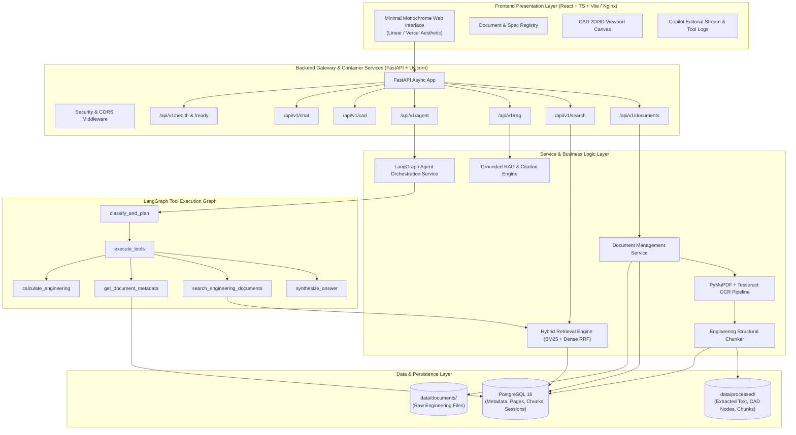
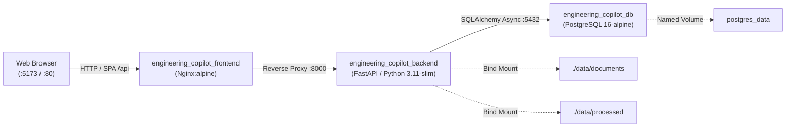

# Architecture: Engineering Document Intelligence & CAD Knowledge Copilot

This document outlines the architectural blueprint, component design, data flow, container orchestration, and technology integrations for the **Engineering Document Intelligence & CAD Knowledge Copilot**.

---

## 1. System Overview

Engineering organizations handle heterogeneous documentation:
1. **Unstructured Documents**: Requirements specifications, regulatory compliance standards, operation & maintenance manuals, test reports, and datasheets (PDF, DOCX, XLSX).
2. **CAD & Geometric Models**: 2D drawings (DXF, DWG) and 3D assembly models (STEP, IGES, STL, Parasolid), containing geometric hierarchies, Bill of Materials (BOM), tolerance annotations, and engineering attributes.

The Copilot is engineered to bridge the semantic gap between textual specifications and CAD models, providing engineers with interactive question answering, automated compliance validation, BOM cross-referencing, and visual model navigation.

---

## 2. High-Level Architecture Diagram



---

## 3. Core Subsystems

### 3.1 Frontend Subsystem (React + TypeScript + Vite / Nginx)
- **Role**: Provides the editorial monochrome engineering interface for uploading files, browsing document registries, querying the autonomous copilot, and inspecting citations and calculation sheets.
- **Key Modules**:
  - `components/layout/`: Header, Navigation Tabs, and live backend connection heartbeat monitor.
  - `components/chat/`: Editorial document-style conversation streams, technical citations (`[C1]`), typographic calculation sheets, and compact technical tool logs.
  - `components/documents/`: Document registry table, upload dropzone, processing status tags, and metadata details.
  - `components/cad/`: Interactive CAD tree view and model placeholder.
  - `services/`: Axios/Fetch API client abstractions with unified TypeScript typings and automatic `/api` routing.
- **Production Containerization**: Multi-stage Docker build (`node:20-alpine` build -> `nginx:alpine` runtime). Nginx handles client-side SPA routing (`try_files $uri $uri/ /index.html;`), proxies `/api/` requests to backend service, provides 50MB request body limits for PDF uploads, and enforces security headers (`X-Content-Type-Options`, `X-Frame-Options`, `X-XSS-Protection`).

### 3.2 Backend Subsystem (FastAPI)
- **Role**: High-performance asynchronous REST API handling file processing, metadata storage, session persistence, OCR fallback, hybrid search, and LangGraph agent execution.
- **Key Layers**:
  - `core/`: Environment settings (Pydantic `BaseSettings`), database connection pool management via async SQLAlchemy 2.x, and structured logging.
  - `api/v1/`: Versioned API routing with validated request and response envelopes.
  - `models/`: Database entities for documents, document pages, document chunks, CAD metadata nodes, and chat sessions.
  - `schemas/`: Pydantic models for validation, serialization, and OpenAPI documentation generation.
  - `services/`: Encapsulated domain business logic decoupled from HTTP transport.
  - `agents/`: LangGraph `StateGraph` workflow with deterministic planner, tool executor, and citation synthesizer.
- **Production Containerization**: Python 3.11 slim image running as unprivileged user `appuser` (UID 1000). System libraries installed for Tesseract OCR (`tesseract-ocr`, `tesseract-ocr-eng`) and OpenCV headless rendering (`libgl1`, `libglib2.0-0`). Managed startup via `entrypoint.sh` executing database connectivity verification and Alembic schema migrations (`alembic upgrade head`).

### 3.3 Data Storage & Persistence
- **PostgreSQL 16**:
  - `documents`: Stores document records, checksums, mime types, file sizes, and processing statuses.
  - `document_pages`: Stores 1-based page records with native text, OCR flag, and image metrics.
  - `document_chunks`: Stores structural engineering chunks with tokens, headings, units, and dense vector embeddings.
  - `cad_metadata`: Stores parsed CAD assembly parts, materials, mass properties, and dimensions.
  - `chat_sessions` & `chat_messages`: Stores multi-turn user conversations, generated responses, token metrics, and citations.
- **Filesystem Storage**:
  - `data/documents/`: Staging area for original engineering documents and CAD files.
  - `data/processed/`: Extracted text, normalized JSON CAD trees, generated previews, and cached chunks.

---

## 4. End-to-End Information & Reasoning Flow

### 4.1 Document Intelligence & Ingestion Pipeline
```text
PDF Upload / Ingestion
        ↓
PyMuPDF Text Extraction & Structure Analysis
        ↓
Native Text Check (Char count >= 50 per page)
   ├── [Native Text Sufficient] ──> Save DocumentPage
   └── [Scanned / Drawing] ──────> OpenCV Image Preprocessing
                                         ↓
                                   Tesseract OCR Engine
                                         ↓
                                   Save DocumentPage (is_ocr=True)
        ↓
Engineering Structural Chunker (Preserves Units, Tolerances, Headings)
        ↓
Dense Vector Generation (1536-dim via LocalMock / Azure OpenAI)
        ↓
Persist DocumentChunk (PostgreSQL document_chunks table)
        ↓
Indexed for Hybrid Retrieval (BM25 + Cosine Vector + Reciprocal Rank Fusion)
```

### 4.2 Autonomous Agent & Tool Reasoning Flow
```text
User Technical Query (e.g. "What is the max working pressure of CFP-402-316L in psi?")
        ↓
LangGraph Agent Workflow (classify_and_plan Node)
        ↓
Tool Planning & Dispatch
   ├── Tool 1: search_engineering_documents ("CFP-402-316L working pressure")
   │      └── Hybrid Search: BM25 + Vector RRF ──> Finds 16.0 bar in Page 1 chunk [C1]
   └── Tool 2: calculate_engineering (operation="bar_to_psi", input=16.0)
          └── Safe Unit Converter ──> 16.0 bar * 14.50377 = 232.06 psi
        ↓
Grounded Synthesis Node (Untrusted Context XML Boundary)
        ↓
Editorial Response: "The maximum working pressure for CFP-402-316L is 16.0 bar [C1], corresponding to 232.06 psi."
        ↓
React Monochrome UI (Live Citation Reference + Tool Traces)
```

---

## 5. Production Containerization & Deployment Topology (Milestone 8)

The application provides a containerized orchestration architecture using Docker Compose:



### 5.1 Service Matrix & Responsibilities

| Service | Image | Internal Port | Host Port | Role & Configuration |
| :--- | :--- | :--- | :--- | :--- |
| **`postgres`** | `postgres:16-alpine` | `5432` | `5432` | PostgreSQL database with persistent named volume `postgres_data` and built-in healthcheck (`pg_isready`). |
| **`backend`** | Custom build (`backend/Dockerfile`) | `8000` | `8000` | FastAPI server running as non-root `appuser`. Managed by `entrypoint.sh` which awaits database readiness and applies `alembic upgrade head`. Built-in healthcheck (`curl /api/v1/health`). |
| **`frontend`** | Custom build (`frontend/Dockerfile`) | `80` | `5173` | Multi-stage build (`node:20-alpine` -> `nginx:alpine`). Serves compiled React assets, proxies `/api/` to backend, handles SPA fallbacks, and executes lightweight healthchecks. |

### 5.2 Container Security & Operational Principles
1. **Unprivileged Non-Root Execution**: Backend container creates and runs under `appuser:appgroup` (UID 1000), eliminating root privilege container escalation risks.
2. **Minimal Layer Attack Surface**: Multi-stage frontend build eliminates `node_modules` and compilation toolchains from runtime images.
3. **Hermetic Secret Management**: Zero credentials or secrets baked into images; configuration is completely environment-driven via `.env` and Docker Compose variables.
4. **Deterministic Migration Sequencing**: Startup race conditions between database and backend are resolved through container dependency conditions (`condition: service_healthy`) and entrypoint connection verification before applying Alembic migrations.
5. **Dual Local / Container Workflow**: Native Windows PostgreSQL 16 development remains completely supported alongside Docker Compose with zero codebase modifications.
6. **Automated CI Validation**: Continuous integration via GitHub Actions (`.github/workflows/ci.yml`) validates the entire test suite, frontend linting, production building, and Docker Compose configurations on every push and pull request.

---

## 6. Live Azure Cloud Deployment & Integration Architecture (Milestone 9)

Milestone 9 transitions the Copilot from local containerization into a live, multi-service enterprise cloud topology hosted on Microsoft Azure. All services are provisioned within resource group `rg-engineering-copilot` adhering to strict Free Tier and low-cost development quotas.

### 6.1 Cloud Topology Diagram

```mermaid
flowchart TB
    subgraph ClientAccess["Client Presentation Layer"]
        WebBrowser["Client Browser (HTTPS)"]
        SWA["Azure Static Web Apps\nstapp-engineering-copilot\n(Free SKU, East US 2)\nlively-river-014b48c0f.6.azurestaticapps.net"]
        StorageWeb["Azure Storage Static Website ($web)\nstengcopilot06724.z13.web.core.windows.net\n(Standard_LRS, East US)"]
    end

    subgraph ComputeServices["Application & Gateway Layer"]
        FastAPIService["FastAPI Copilot Backend\n- StorageService (Azure Blob SDK)\n- AzureSearchIndex (REST 2023-11-01)\n- AzureOpenAIChatProvider (gpt-4o)\n- AzureOpenAIEmbeddingProvider (1536-dim)"]
        ACR["Azure Container Registry\nacrengcopilot06724.azurecr.io\n(Basic SKU, East US)"]
    end

    subgraph ManagedData["Azure Managed Data & AI Services"]
        AzurePG[("Azure Database for PostgreSQL Flexible Server\npsql-engcopilot-06724.postgres.database.azure.com\nPostgreSQL 16 | Standard_B1ms | Central US\n7 Tables | Alembic Head Applied")]
        AzureBlob[("Azure Blob Storage\nstengcopilot06724.blob.core.windows.net\nContainer: 'documents'\nRaw PDF Ingestion & Cold Storage")]
        AzureSearch["Azure AI Search\nsearch-engineering-copilot.search.windows.net\nFree Tier | East US\n- engineering-docs-index (HNSW Vector + BM25)\n- cad-knowledge-index"]
        AzureOpenAI["Azure OpenAI Service\naoai-engineering-copilot-06724.openai.azure.com\nStandard S0 | East US\n- text-embedding-3-small (1536 dims)\n- gpt-4o (gpt-4.1-mini)"]
    end

    WebBrowser -->|HTTPS| SWA
    WebBrowser -->|HTTPS| StorageWeb
    SWA -.->|API Requests| FastAPIService
    StorageWeb -.->|API Requests| FastAPIService

    FastAPIService -->|Asyncpg / SSL (5432)| AzurePG
    FastAPIService -->|Upload / Download Blobs| AzureBlob
    FastAPIService -->|Vector + Keyword Hybrid Search| AzureSearch
    FastAPIService -->|Generate 1536-dim Embeddings| AzureOpenAI
    FastAPIService -->|Grounded Chat Synthesis| AzureOpenAI
    ACR -.->|Container Image Storage| FastAPIService
```

### 6.2 Live Azure Services Matrix

| Service / Resource Name | Type & SKU | Region | Endpoint / Host | Configuration & Verified Role |
| :--- | :--- | :--- | :--- | :--- |
| **`psql-engcopilot-06724`** | Azure Database for PostgreSQL Flexible Server (`Standard_B1ms`, 32GB) | `centralus` | `psql-engcopilot-06724.postgres.database.azure.com:5432` | **VERIFIED**: PostgreSQL 16; applied all 7 Alembic migrations (`alembic upgrade head`); stores documents, pages, chunks, and sessions. |
| **`aoai-engineering-copilot-06724`** | Azure OpenAI Service (`S0`) | `eastus` | `https://aoai-engineering-copilot-06724.openai.azure.com/` | **VERIFIED**: `text-embedding-3-small` (1536 dimensions) for dense indexing; `gpt-4o` (`gpt-4.1-mini`) for grounded RAG synthesis. |
| **`search-engineering-copilot`** | Azure AI Search (`Free` Tier) | `eastus` | `https://search-engineering-copilot.search.windows.net` | **VERIFIED**: Created `engineering-docs-index` (HNSW vector profile + searchable text) and `cad-knowledge-index`. Uses API 2023-11-01 `vectorQueries`. |
| **`stengcopilot06724`** | Azure Storage Account (`Standard_LRS`, StorageV2) | `eastus` | `https://stengcopilot06724.blob.core.windows.net` | **VERIFIED**: Container `documents` for raw PDF persistence via `StorageService`. Static website `$web` serving production React bundle. |
| **`stengcopilot06724.z13.web.core.windows.net`** | Azure Storage Static Website | `eastus` | `https://stengcopilot06724.z13.web.core.windows.net/` | **VERIFIED**: Deployed compiled React bundle (`frontend/dist`); returns HTTP 200 OK. |
| **`stapp-engineering-copilot`** | Azure Static Web Apps (`Free`) | `eastus2` | `https://lively-river-014b48c0f.6.azurestaticapps.net` | **CONFIGURED**: Provisioned with deployment token for automated CI/CD static frontend delivery. |
| **`acrengcopilot06724`** | Azure Container Registry (`Basic`) | `eastus` | `acrengcopilot06724.azurecr.io` | **CONFIGURED**: Container registry for packaging and distributing Docker images. |

### 6.3 Security, Networking & Cost Boundaries

1. **Defense-in-Depth Credentials**: Zero credentials committed to version control. Production configuration is driven via `backend/.env.azure.example` templates and Azure Key Vault / app configuration.
2. **Encrypted Transport**: Enforced TLS 1.2+ for PostgreSQL (`ssl=require`), HTTPS for Azure OpenAI and AI Search, and secure blob URLs.
3. **CORS Allowlisting**: Backend `CORS_ORIGINS` explicitly allowlists both Azure frontend hosting endpoints alongside local development ports.
4. **Zero-Cost / Free-Tier Compliance**:
   - Azure AI Search Free tier: $0/month.
   - Azure Static Web Apps Free SKU: $0/month.
   - Azure OpenAI & Storage: Consumes cents from the initial Azure Free Trial credit.
   - Azure PostgreSQL B1ms: Burstable minimal compute footprint.
   - Immediate teardown enabled via single CLI invocation: `az group delete --name rg-engineering-copilot --yes --no-wait`.

---

## 7. Implementation Status & Milestone Roadmap

| Milestone | Scope & Capabilities | Status |
| :--- | :--- | :--- |
| **Milestone 1** | Repository structure, project scaffolding, base types, Docker templates. | Completed |
| **Milestone 2** | **Backend Foundation**: Asynchronous FastAPI, layered Service architecture, async SQLAlchemy 2.0 with PostgreSQL, bidirectional Alembic migrations, foundational Document metadata API (`GET`, `POST`), structured error handlers, and hermetic automated pytest suite. | Completed |
| **Milestone 3** | **Document Intelligence Pipeline**: Page-by-page PDF processing with PyMuPDF, scanned page detection heuristic, OpenCV image preprocessing, Tesseract OCR fallback, 1-based `DocumentPage` persistence in PostgreSQL, file upload endpoint (`POST /upload`), and page retrieval APIs. | Completed |
| **Milestone 4** | **Document Chunking & Hybrid Vector Search**: Structural/semantic engineering chunker preserving engineering notation, tolerances, units, and page provenance; 1536-dimensional vector embedding architecture; hybrid BM25 + vector search engine with Reciprocal Rank Fusion (RRF); `DocumentChunk` schema and Alembic migrations. | Completed |
| **Milestone 5** | **Retrieval-Augmented Generation (RAG)**: Grounded question-answering system combining hybrid retrieval with LLM synthesis; dual LLM provider layer (`BaseLLMProvider`, `LocalMockChatProvider`, `AzureOpenAIChatProvider`); structured evidence context assembly with citation tagging (`[C1]`); prompt injection defense; and explicit abstention protocol. | Completed |
| **Milestone 6** | **LangGraph Engineering Copilot Agent**: Autonomous stateful agent workflow orchestrated with LangGraph; genuine tool usage across three tools (`search_engineering_documents`, `get_document_metadata`, and safe `calculate_engineering`); multi-tool chaining for technical queries requiring calculation; citation provenance preservation; and standardized abstention. | Completed |
| **Milestone 7** | **Visual Design System**: Complete frontend transformation adhering to strict monochrome aesthetic (Linear, Vercel, Google Antigravity). Editorial conversation streams, typographic calculation result blocks, bordered citation references, compact technical tool logs, live backend health monitoring, and zero accent colors or cartoon AI decorations. | Completed |
| **Milestone 8** | **Productionization & Container Orchestration**: Production-grade Docker Compose architecture (`postgres:16-alpine`, Python 3.11-slim backend with system OCR and non-root execution, multi-stage Node 20 / Nginx Alpine frontend), automated startup migration handling (`entrypoint.sh`), `.dockerignore` file hygiene, environment variable categorization, health checks, GitHub Actions CI pipeline (`.github/workflows/ci.yml`), and 85 passing tests. | Completed |
| **Milestone 9** (Current) | **Live Azure Cloud Deployment & Service Integration**: Multi-service enterprise Azure topology (`rg-engineering-copilot`): Azure PostgreSQL Flexible Server v16 (`psql-engcopilot-06724`), Azure OpenAI Service (`text-embedding-3-small` + `gpt-4o`), Azure AI Search (`search-engineering-copilot` with hybrid HNSW vector search), Azure Blob Storage (`stengcopilot06724`), Azure Storage Static Website & Azure Static Web Apps, and end-to-end live verification test suite. | Completed |
| **Milestone 10** | **CAD Extension**: STEP/DXF geometric parser, 3D WebGL viewport canvas, and BOM cross-referencing. | Planned |
