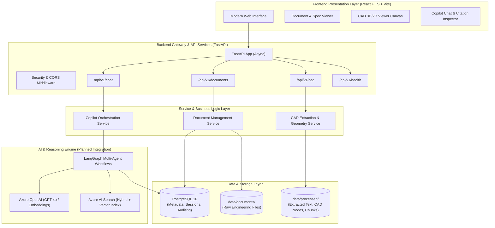
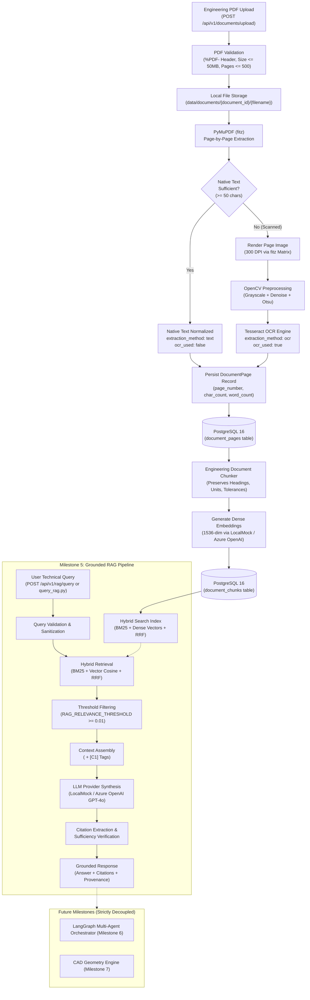

# Architecture: Engineering Document Intelligence & CAD Knowledge Copilot

This document outlines the architectural blueprint, component design, data flow, and technology integrations for the **Engineering Document Intelligence & CAD Knowledge Copilot**.

---

## 1. System Overview

Engineering organizations handle heterogeneous documentation:
1. **Unstructured Documents**: Requirements specifications, regulatory compliance standards, operation & maintenance manuals, test reports, and datasheets (PDF, DOCX, XLSX).
2. **CAD & Geometric Models**: 2D drawings (DXF, DWG) and 3D assembly models (STEP, IGES, STL, Parasolid), containing geometric hierarchies, Bill of Materials (BOM), tolerance annotations, and engineering attributes.

The Copilot is engineered to bridge the semantic gap between textual specifications and CAD models, providing engineers with interactive question answering, automated compliance validation, BOM cross-referencing, and visual model navigation.

---

## 2. High-Level Architecture Diagram

---

## 3. Core Subsystems

### 3.1 Frontend Subsystem (React + TypeScript + Vite)
- **Role**: Provides the engineering user interface for uploading files, browsing documents, inspecting extracted CAD structures, and conversing with the copilot.
- **Key Modules**:
  - `components/layout/`: Main application navigation, sidebar, and status indicators.
  - `components/documents/`: Document lists, upload dropzone, processing status tags.
  - `components/cad/`: Interactive CAD tree view and model placeholder.
  - `components/chat/`: Conversational interface supporting multi-turn dialogue, markdown formatting, and source citation cards.
  - `services/`: Axios/Fetch API client abstractions with strong TypeScript typings.

### 3.2 Backend Subsystem (FastAPI)
- **Role**: High-performance asynchronous REST API handling file processing, metadata storage, session persistence, and routing agent actions.
- **Key Layers**:
  - `core/`: Environment settings (Pydantic `BaseSettings`), database connection pool management via async SQLAlchemy, and structured logging.
  - `api/v1/`: Versioned API routing with validated request and response envelopes.
  - `models/`: Database entities for documents, CAD metadata nodes, chat sessions, and message history.
  - `schemas/`: Pydantic models for validation, serialization, and OpenAPI documentation generation.
  - `services/`: Encapsulated domain business logic decoupled from HTTP transport.

### 3.3 Data Storage & Persistence
- **PostgreSQL 16**:
  - `documents`: Stores document records, checksums, mime types, file sizes, and processing statuses.
  - `cad_metadata`: Stores parsed CAD assembly parts, materials, mass properties, and dimensions.
  - `chat_sessions` & `chat_messages`: Stores multi-turn user conversations, generated responses, token metrics, and citations.
- **Filesystem Storage**:
  - `data/documents/`: Secure staging area for original engineering documents and CAD files.
  - `data/processed/`: Extracted text, normalized JSON CAD trees, generated previews, and cached chunks.

### 3.4 Search & Embeddings Engine (Milestone 4 Implemented)
- **Embedding Layer**:
  - Abstract interface `BaseEmbeddingProvider` with factory pattern (`get_embedding_provider`).
  - `LocalMockEmbeddingProvider`: Deterministic token-hash random projection generating unit-normalized 1536-dimensional dense vectors offline without API keys or cloud dependencies.
  - `AzureOpenAIEmbeddingProvider`: Production integration connecting to Azure OpenAI (`text-embedding-3-large`).
- **Hybrid Search Engine**:
  - Abstract interface `BaseSearchIndex` with factory pattern (`get_search_index`).
  - `LocalSearchIndex`: In-process hybrid search engine supporting BM25 lexical keyword matching, cosine vector similarity, and Reciprocal Rank Fusion (RRF).
  - `AzureSearchIndex`: Production cloud integration targeting Azure AI Search REST API.
  - **Reciprocal Rank Fusion (RRF)**:
    $$RRF(d) = \sum_{m \in \{\text{keyword}, \text{vector}\}} \frac{1}{60 + \text{rank}_m(d)}$$
  - Metadata filtering: Granular filtering by `document_id`, `document_type`, `part_number`, `revision`, and `page_number`.

### 3.5 Grounded Retrieval-Augmented Generation (RAG) (Milestone 5 Implemented)
- **Dual LLM Provider Layer**:
  - Abstract interface `BaseLLMProvider` with factory pattern (`get_llm_provider`).
  - `LocalMockChatProvider`: Offline deterministic mock provider delivering grounded synthesis, unit/tolerance preservation, citation linking (`[C1]`, `[C2]`), and standard abstention without cloud credentials.
  - `AzureOpenAIChatProvider`: Production cloud integration using official REST endpoints (`AZURE_OPENAI_CHAT_DEPLOYMENT` / `gpt-4o`).
  - Provider auto-detection: selects `azure_openai` if endpoint and credentials exist; falls back to `local_mock` seamlessly.
- **Context Assembly & Prompt Isolation**:
  - `ContextBuilder`: Assembles retrieved candidate chunks above relevance threshold (`RAG_RELEVANCE_THRESHOLD`) into structured evidence blocks wrapped in `<engineering_context>`.
  - Untrusted Data Boundary: Document text is explicitly isolated as untrusted data to immunize synthesis against prompt injections embedded in PDFs.
- **Strict Grounding & Citation Extraction**:
  - In-text citation tags (`[C1]`, `[C2]`) mapped directly to `CitationItem` metadata (`document_id`, `filename`, `page_number`, `chunk_id`, `chunk_index`, `part_number`, `revision`, `section`, `snippet`).
  - Explicit Abstention: When evidence is insufficient or missing, cleanly returns standard response (`"The available documents do not contain enough information to answer this question."`) with `sufficient_evidence=False` and empty citations.
- **REST API & CLI**:
  - `POST /api/v1/rag/query` exposing grounded engineering question-answering.
  - `scripts/query_rag.py` providing interactive CLI querying with formatted citations.

### 3.6 Autonomous Agent & CAD Extensions (Future Milestones)
- **LangGraph Multi-Agent Workflows (Milestone 6)**: Multi-turn conversational workflows, tool execution, and human-in-the-loop review.
- **CAD Geometry Engine (Milestone 7)**: STEP/DXF metadata extraction, BOM cross-referencing, and visual integration.

---

## 4. Document Intelligence, Hybrid Search & Grounded RAG Pipeline (Milestones 3, 4 & 5 Implemented)

---

## 5. Security & Production Principles

1. **Strict Secret Isolation**: No API keys or credentials committed to source code; managed via `.env` and secret stores.
2. **Path Traversal Protection**: Uploaded filenames are sanitized with basename isolation to prevent directory traversal attacks (`../../`).
3. **Information Disclosure Prevention**: Global exception handlers redact absolute filesystem paths, database connection strings, and stack traces from API responses.
4. **Untrusted Context Isolation**: Retrieved document text is treated strictly as passive, untrusted data wrapped in XML boundaries to defend against prompt injections.
5. **Async I/O**: Asynchronous database and HTTP calls to prevent blocking the event loop during heavy concurrent workloads.
6. **Structured Logging**: Contextual logs with query tokens, hit counts, latency, and provenance without logging raw sensitive engineering documents.
7. **Graceful Degradation**: Dual provider architecture allows local development and automated testing with zero cloud credentials, automatically promoting to Azure OpenAI and Azure AI Search when credentials are provided.

---

## 6. Implementation Status & Milestone Roadmap

| Milestone | Scope & Capabilities | Status |
| :--- | :--- | :--- |
| **Milestone 1** | Repository structure, project scaffolding, base types, Docker templates. | Completed |
| **Milestone 2** | **Backend Foundation**: Asynchronous FastAPI, layered Service architecture, async SQLAlchemy 2.0 with PostgreSQL, bidirectional Alembic migrations, foundational Document metadata API (`GET`, `POST`), structured error handlers, and hermetic automated pytest suite. Azure OpenAI & AI Search configurations are decoupled and optional. | Completed |
| **Milestone 3** | **Document Intelligence Pipeline**: Page-by-page PDF processing with PyMuPDF, scanned page detection heuristic, OpenCV image preprocessing, Tesseract OCR fallback, 1-based `DocumentPage` persistence in PostgreSQL, file upload endpoint (`POST /upload`), page retrieval APIs (`GET /pages`, `GET /pages/{num}`), CLI ingestion tool (`ingest_cad_docs.py`), and 24 passing automated tests. | Completed |
| **Milestone 4** | **Document Chunking & Hybrid Vector Search**: Structural/semantic engineering chunker preserving engineering notation, tolerances, units, and page provenance; 1536-dimensional vector embedding architecture with deterministic offline mock and Azure OpenAI client; hybrid BM25 + vector search engine with Reciprocal Rank Fusion (RRF); `DocumentChunk` schema and Alembic migrations; chunk generation and search API endpoints (`/chunks/generate`, `/chunks`, `/search`); CLI retrieval tool (`search_docs.py`); and 41 passing automated tests. | Completed |
| **Milestone 5** (Current) | **Retrieval-Augmented Generation (RAG)**: Grounded question-answering system combining hybrid retrieval with LLM synthesis; dual LLM provider layer (`BaseLLMProvider`, `LocalMockChatProvider`, `AzureOpenAIChatProvider`); structured evidence context assembly with citation tagging (`[C1]`, `[C2]`); strict unit/tolerance/part-number fidelity; prompt injection defense with untrusted context isolation; explicit abstention protocol (`sufficient_evidence=False`); REST endpoint `POST /api/v1/rag/query`; CLI tool `scripts/query_rag.py`; and 56 passing automated tests. | Completed |
| **Milestone 6** | **LangGraph Copilot Agent**: Multi-turn dialogue, tool execution, citation generation with page-level verification loop, and human-in-the-loop engineering reviews. | Planned |
| **Milestone 7** | **CAD Extension**: STEP/DXF metadata extraction, BOM cross-referencing, and 3D visual integration. | Planned |

