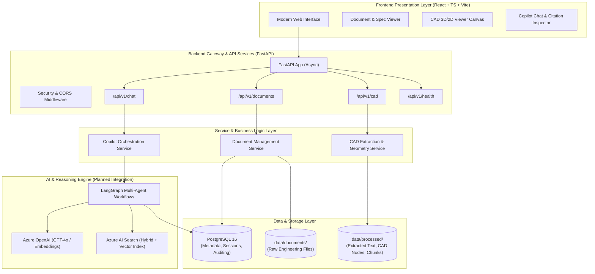
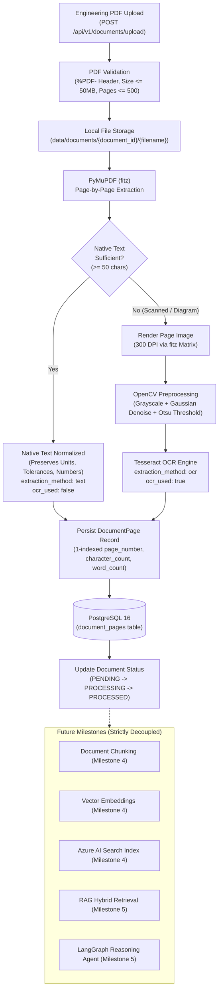

# Architecture: Engineering Document Intelligence & CAD Knowledge Copilot

This document outlines the architectural blueprint, component design, data flow, and technology integrations for the **Engineering Document Intelligence & CAD Knowledge Copilot**.

---

## 1. System Overview

Engineering organizations handle heterogeneous documentation:
1. **Unstructured Documents**: Requirements specifications, regulatory compliance standards, operation & maintenance manuals, test reports, and datasheets (PDF, DOCX, XLSX).
2. **CAD & Geometric Models**: 2D drawings (DXF, DWG) and 3D assembly models (STEP, IGES, STL, Parasolid), containing geometric hierarchies, Bill of Materials (BOM), tolerance annotations, and engineering attributes.

The Copilot is engineered to bridge the semantic gap between textual specifications and CAD models, providing engineers with interactive question answering, automated compliance validation, BOM cross-referencing, and visual model navigation.

---

## 2. High-Level Architecture Diagram

---

## 3. Core Subsystems

### 3.1 Frontend Subsystem (React + TypeScript + Vite)
- **Role**: Provides the engineering user interface for uploading files, browsing documents, inspecting extracted CAD structures, and conversing with the copilot.
- **Key Modules**:
  - `components/layout/`: Main application navigation, sidebar, and status indicators.
  - `components/documents/`: Document lists, upload dropzone, processing status tags.
  - `components/cad/`: Interactive CAD tree view and model placeholder.
  - `components/chat/`: Conversational interface supporting multi-turn dialogue, markdown formatting, and source citation cards.
  - `services/`: Axios/Fetch API client abstractions with strong TypeScript typings.

### 3.2 Backend Subsystem (FastAPI)
- **Role**: High-performance asynchronous REST API handling file processing, metadata storage, session persistence, and routing agent actions.
- **Key Layers**:
  - `core/`: Environment settings (Pydantic `BaseSettings`), database connection pool management via async SQLAlchemy, and structured logging.
  - `api/v1/`: Versioned API routing with validated request and response envelopes.
  - `models/`: Database entities for documents, CAD metadata nodes, chat sessions, and message history.
  - `schemas/`: Pydantic models for validation, serialization, and OpenAPI documentation generation.
  - `services/`: Encapsulated domain business logic decoupled from HTTP transport.

### 3.3 Data Storage & Persistence
- **PostgreSQL 16**:
  - `documents`: Stores document records, checksums, mime types, file sizes, and processing statuses.
  - `cad_metadata`: Stores parsed CAD assembly parts, materials, mass properties, and dimensions.
  - `chat_sessions` & `chat_messages`: Stores multi-turn user conversations, generated responses, token metrics, and citations.
- **Filesystem Storage**:
  - `data/documents/`: Secure staging area for original engineering documents and CAD files.
  - `data/processed/`: Extracted text, normalized JSON CAD trees, generated previews, and cached chunks.

### 3.4 AI Orchestration & Search Engine (Planned Integration)
- **LangGraph**:
  - State machine-based multi-agent orchestration.
  - Routes complex queries across hybrid search, CAD metadata lookup, and synthesis agents.
  - Enables human-in-the-loop validation for engineering change recommendations.
- **Azure OpenAI**:
  - Language Model: `gpt-4o` for deep technical synthesis and engineering reasoning.
  - Embedding Model: `text-embedding-3-large` for dense semantic representation.
- **Azure AI Search**:
  - Hybrid search combining BM25 keyword matching and dense vector search with Semantic Re-ranking.
  - Separate indexes for text documents and CAD metadata/assembly nodes.

---

## 4. Document Intelligence & OCR Pipeline (Milestone 3 Implemented)

---

## 5. Security & Production Principles

1. **Strict Secret Isolation**: No API keys or credentials committed to source code; managed via `.env` and secret stores.
2. **Path Traversal Protection**: Uploaded filenames are sanitized with basename isolation to prevent directory traversal attacks (`../../`).
3. **Information Disclosure Prevention**: Global exception handlers redact absolute filesystem paths, database connection strings, and stack traces from API responses.
4. **Async I/O**: Asynchronous database and HTTP calls to prevent blocking the event loop during heavy concurrent workloads.
5. **Structured Logging**: Contextual logs with document ID and page numbers for pipeline observability without logging full extracted document texts.

---

## 6. Implementation Status & Milestone Roadmap

| Milestone | Scope & Capabilities | Status |
| :--- | :--- | :--- |
| **Milestone 1** | Repository structure, project scaffolding, base types, Docker templates. | Completed |
| **Milestone 2** | **Backend Foundation**: Asynchronous FastAPI, layered Service architecture, async SQLAlchemy 2.0 with PostgreSQL, bidirectional Alembic migrations, foundational Document metadata API (`GET`, `POST`), structured error handlers, and hermetic automated pytest suite. Azure OpenAI & AI Search configurations are decoupled and optional. | Completed |
| **Milestone 3** (Current) | **Document Intelligence Pipeline**: Page-by-page PDF processing with PyMuPDF, scanned page detection heuristic, OpenCV image preprocessing, Tesseract OCR fallback, 1-based `DocumentPage` persistence in PostgreSQL, file upload endpoint (`POST /upload`), page retrieval APIs (`GET /pages`, `GET /pages/{num}`), CLI ingestion tool (`ingest_cad_docs.py`), and 24 passing automated tests. | Completed |
| **Milestone 4** | **Document Chunking & Vector Search**: Contextual chunking preserving technical tables and sections, embedding generation, and Azure AI Search hybrid index. | Planned |
| **Milestone 5** | **LangGraph Copilot Agent**: Multi-turn dialogue, citation generation with page-level verification loop, and technical synthesis. | Planned |
| **Milestone 6** | **CAD Extension**: STEP/DXF metadata extraction, BOM cross-referencing, and visual integration. | Planned |

